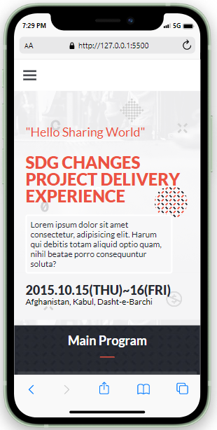

> # Salsal Developers Group Website
### Mobile and Desktop view shoots for this project:

| Desktop version representation|
|---------------------------------------|
||
||
||
||

| Mobile version representation |
|---------------------------------------|
|

|

# 📗 Table of Contents

- [📖 About the Project](#about-project)
  - [🛠 Built With](#built-with)
    - [Tech Stack](#tech-stack)
    - [Key Features](#key-features)
  - [🚀 Live Demo](#live-demo)
- [💻 Getting Started](#getting-started)
  - [Setup](#setup)
  - [Prerequisites](#prerequisites)
  - [Install](#install)
  - [Usage](#usage)
  - [Deployment](#triangular_flag_on_post-deployment)
- [👥 Authors](#authors)
- [🔭 Future Features](#future-features)
- [🤝 Contributing](#contributing)
- [⭐️ Show your support](#support)
- [🙏 Acknowledgements](#acknowledgements)
- [❓ FAQ (OPTIONAL)](#faq)
- [📝 License](#license)

# 📖 [SalsalDevGroup] 

> **[SalsalDevGroup Website]** is a project to showcase the Salsal Developers group recent projects. It will maitain the information and history of the group recent projects, the brave biography of each developer, and the link to recent projects. it will also provide the context for receiving proposals and contacting the clients in its future features.

**[SalsalDevGroup Website]** is developed using HTML, CSS and JavaScript technologies.

## 🛠 Built With 

### Tech Stack 
- 
Client

    <ul>
      <li><a href="https://reactjs.org/">HTML</a></li>
      <li><a href="https://reactjs.org/">CSS</a></li>
      <li><a href="https://reactjs.org/">JavaScript</a></li>
    </ul>

### Key Features 

- **[Responsive layout]**
- **[UX/UI accessibility]**
- **[Dynamic data]**

(<a href="#readme-top">back to top</a>)

## 🚀 Live Demo 
> - [Live Demo on Gh-pages](https://ab-noori.github.io/SalsalDevGroup/)
> - [Live Demo on Render](https://salsaldevgroup.onrender.com)
> - [Introduction to the project](https://www.loom.com/share/abd300bec7be47d784b3e9f6af64eab7)

(<a href="#readme-top">back to top</a>)

<!-- GETTING STARTED -->

## 💻 Getting Started 

To get a local copy up and running, follow these steps:

### Prerequisites

In order to run this project you need:
  - A browser of you choice.
  - A text editor of your choice.
  - An installed node.js on your local system

### Setup

Clone this repository to your desired folder:

- Use the following Commands:

      cd your-desired-folder
      git clone git@github.com:ab-noori/SalsalDevGroup.git

### Install

Install this project with:

  - You can deploy this projec on hosting provider of your choise or you can deploy it on github pages.

### Usage

- To show history and information about SDG group
- To represent the most recent projects.
- To maitain connection with clients.

### Run tests
- Run the following script and style test:

      npx hint .
      npx hint . --fix
      
      npx eslint .
      npx eslint . --fix

      npx stylelint "**/*.{css,scss}"
      npx stylelint "**/*.{css,scss}" --fix
      
### Deployment

You can deploy this project using:
- Free deployment services like GitHub pages.
- Any deployment services of your choice.

(<a href="#readme-top">back to top</a>)

## 👥 Authors 

👤 **Abdul Ali Noori**

- GitHub: [@ab-noori](https://github.com/ab-noori)
- Twitter: [@AbdulAliNoori4](https://twitter.com/AbdulAliNoori4)
- LinkedIn: [abdul-ali-noori](https://www.linkedin.com/in/abdul-ali-noori-384b85195/)

(<a href="#readme-top">back to top</a>)

## 🔭 Future Features 

- [ ] **[Add news section]**
- [ ] **[Add sponsership section]**

(<a href="#readme-top">back to top</a>)

## 🤠Contributing 

Contributions, issues, and feature requests are welcome!

Feel free to check the [issues page](https://github.com/ab-noori/SalsalDevGroup/issues).

(<a href="#readme-top">back to top</a>)

## ⭐️ Show your support 

 
  If you like this project, give it a star.

(<a href="#readme-top">back to top</a>)

## 🙠Acknowledgments 

  I would like to thank Microverse and my coding partners, and also give credit to Cindy Shin, the original author of the design.

(<a href="#readme-top">back to top</a>)

## ❓ FAQ (OPTIONAL) 

- **How to make it mobile friendly?**

  - Put a viewport tag in the header

- **How to design the site?**

  - Draw a mockup before start to code

(<a href="#readme-top">back to top</a>)

## 📠License 

This project is [MIT](./LICENSE) licensed.

(<a href="#readme-top">back to top</a>)

